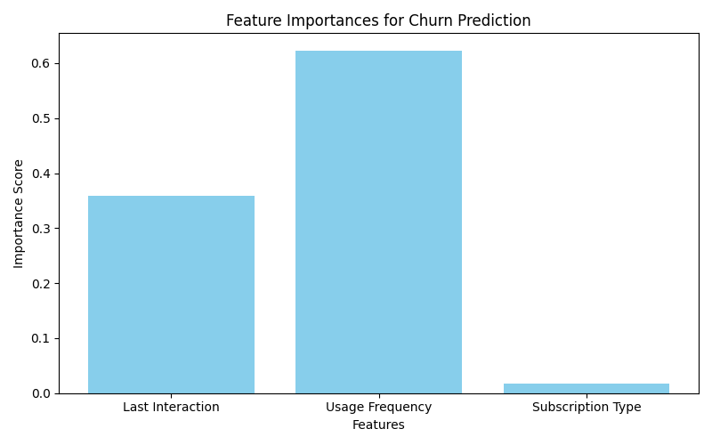

# EdTech Churn Prediction


## Business Problem
In the EdTech industry, the cost of acquiring a new customer is significantly higher than retaining an existing one. High churn rates directly erode revenue and indicate potential issues with user engagement or content quality. This project focuses on predicting which users are most likely to churn based on their platform activity and subscription details. By identifying at-risk users, the business can proactively offer targeted retention discounts and personalized interventions.

## Tech Stack
* **Python**: Core programming language.
* **Pandas**: For dataset manipulation.
* **Scikit-Learn**: For data splitting, label encoding, and training the Random Forest Classifier.
* **Matplotlib**: For visualizing feature importance.

## Methodology
1. **Data Ingestion**: The script loads user engagement and subscription data from the `data/` directory.
2. **Data Preprocessing**: Missing values are dropped and categorical features like Subscription Type are converted into numerical formats using Label Encoding.
3. **Model Training**: A Random Forest Classifier is trained on historical data, learning the relationships between engagement metrics and the likelihood of churning.
4. **Evaluation**: The model is evaluated on a hold-out test set to determine its accuracy.
5. **Feature Importance**: The strongest predictors of churn are extracted and visualized.

## Project Structure
* `data/`: Contains the raw dataset.
* `src/`: Modularized python scripts (`preprocess.py`, `model.py`).
* `main.py`: The entry point script to run the predictive pipeline.
* `requirements.txt`: Python package dependencies.

## Results
After training the Random Forest Classifier, the model achieved an accuracy of **54.24%**. 

The analysis determined the following feature importances in predicting churn:
* **Usage Frequency:** 0.6232
* **Last Interaction:** 0.3592
* **Subscription Type:** 0.0176



## Setup Instructions
**Prerequisites:**
Place the dataset inside the `data/` directory and rename it to `edtech_users.csv`.

Install dependencies:
```bash
pip install -r requirements.txt
```

**Execution:**
Run the predictive pipeline using the following command:
```bash
python main.py
```
